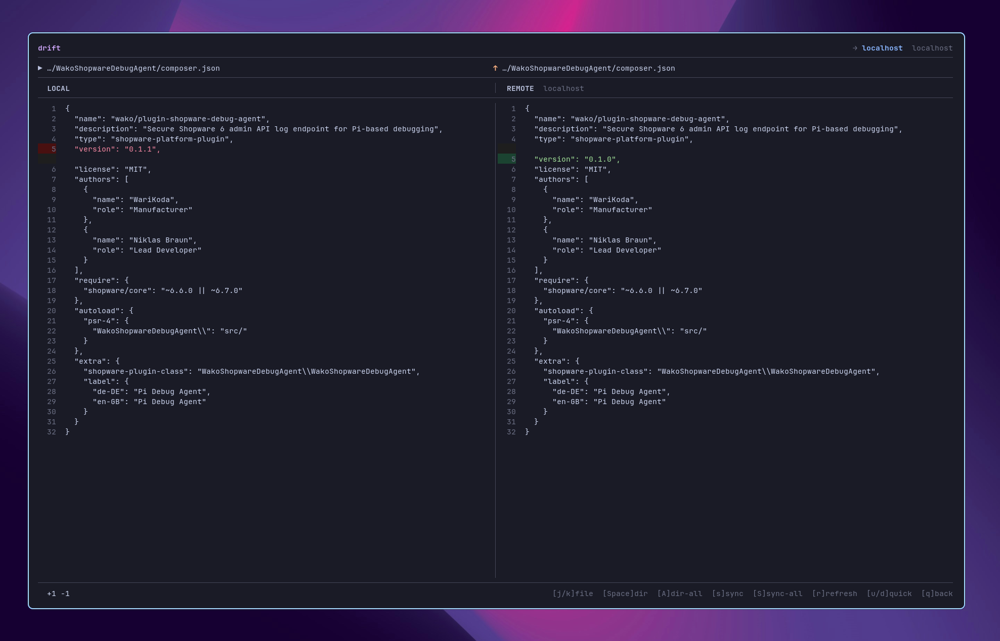

# drift

A terminal TUI for browsing, diffing, and syncing files with remote hosts — think PHPStorm's "Browse Remote Host" and "Sync with Deployed To", but in your terminal.

Supports **SFTP/SSH** and **FTP** targets. Runs on Linux and macOS.



> [!WARNING]
> **Alpha:** drift is in an early public stage. Expect rough edges, incomplete polish, and breaking changes between releases.

---

## Features

- File browser with multi-select (Space) and recursive directory marking
- Side-by-side diff view for local vs. remote files
- Per-file sync direction control: upload ↑, download ↓, delete local ✗, delete remote ✗, or skip —
- Bulk sync direction toggle (A key cycles all files at once)
- Auto pre-selection of sync direction based on file modification time
- Sync current file (s) or all marked files (S) in one keystroke
- Per-host path mappings (like PHPStorm's Deployment Mappings tab)
- Host manager: create, edit, delete, and test connections
- Global config (`~/.config/drift/config.toml`) + project-level config (`.drift/config.toml`)
- Skips `.git`, `node_modules`, `.idea`, and other irrelevant directories automatically

---

## Installation

### From source (requires Go 1.25+)

```bash
git clone https://github.com/WariKoda/drift.git
cd drift
make install
```

This builds the binary and installs it to `~/.local/bin/drift`.

### Directly with Go

```bash
go install github.com/WariKoda/drift@latest
```

### Update after code changes

```bash
make update
```

---

## Usage

```bash
# Start in the current directory (or the project dashboard, see below)
drift

# Open the project dashboard explicitly
drift dash

# Open a registered project directly
drift open kunde-a

# Manage projects
drift projects list
drift projects add "KUNDE A" ~/work/kunde-a
drift projects edit kunde-a --name "KUNDE A GmbH" --path ~/work/kunde-a
drift projects archive kunde-a
drift projects remove kunde-a

# Show version
drift version
```

Navigate to any file or directory, press **Space** to mark it, then **s** to open the sync target picker.

### Project dashboard

drift can keep a registry of your projects (one per customer, say) and show them in a
dashboard on startup. From the dashboard you select a project and drift re-roots into it:
it loads that project's config and opens the file browser in its directory — the same as
`cd <path> && drift`, but without leaving drift.

The dashboard appears automatically when you run `drift` **outside** any project
(no `.drift/` found) and at least one project is registered. Inside a project directory,
`drift` opens the browser as before. Override with `--dashboard` / `--no-dashboard`, or
force it with `drift dash`.

Each project stores only a slug, display name, local path and timestamps in
`~/.config/drift/projects.toml`. Hosts and mappings continue to live in the project's own
`<path>/.drift/config.toml` — nothing is duplicated.

When you start `drift` inside a `.drift` project that isn't registered yet, it offers to
add it to the registry (name defaults to the directory name). Press `y` to register or any
other key to skip — you can always register later with `drift projects add .`.

### Typical workflow

1. Run `drift` in your project directory
2. Mark one or more files/directories with **Space**
3. Press **s** and choose a host
4. Review diffs and suggested sync directions
5. Sync the current file with **s** or all files with **S**

---

## Key Bindings

### Project Dashboard

| Key | Action |
|-----|--------|
| `j` / `k` or `↑` / `↓` | Navigate |
| `Enter` | Open project (re-root drift into it) |
| `n` | New project |
| `e` | Edit project |
| `d` | Remove project (with confirmation) |
| `a` | Archive / unarchive project |
| `.` | Show / hide archived projects |
| `q` / `Esc` | Quit drift |

### File Browser

| Key | Action |
|-----|--------|
| `j` / `k` or `↑` / `↓` | Navigate |
| `Space` | Mark / unmark file or directory |
| `Enter` | Open directory |
| `Backspace` | Go up one level |
| `s` | Sync marked files (opens host selector) |
| `H` | Open host manager |
| `P` | Open project dashboard |
| `q` / `Esc` | Quit |

### Diff View

| Key | Action |
|-----|--------|
| `j` / `k` | Navigate file list |
| `J` / `K` | Scroll diff content |
| `Space` | Cycle sync direction for current file |
| `A` | Cycle sync direction for all files |
| `s` | Sync current file |
| `S` | Sync all files |
| `r` | Refresh diffs |
| `Esc` | Back to browser |

### Host Manager

| Key | Action |
|-----|--------|
| `n` | New host |
| `e` / `Enter` | Edit host |
| `d` | Delete host |
| `t` | Test connection |
| `Esc` | Back |

---

## Configuration

### Global config: `~/.config/drift/config.toml`

```toml
[defaults]
user = "deploy"

[[hosts]]
name       = "prod"
hostname   = "example.com"
port       = 22
user       = "deploy"
root_path  = "/var/www/html"
protocol   = "sftp"

  [hosts.auth]
  type     = "keyfile"
  key_file = "~/.ssh/id_ed25519"
```

### Project config: `.drift/config.toml`

Place this file in your project root. drift walks up from the working directory to find it.

```toml
[[hosts]]
name      = "staging"
hostname  = "shopdev.example.com"
port      = 21
user      = "webuser"
root_path = "/var/www"
protocol  = "ftp"

  [hosts.auth]
  type     = "password"
  password = "$DEPLOY_PASSWORD"

  # For ftps with a self-signed / mismatched certificate (skips TLS verification):
  # insecure_tls = true

  [[hosts.mappings]]
  local  = "plugins/plugin1"
  remote = "html/custom/plugins/plugin1"

  [[hosts.mappings]]
  local  = "plugins/plugin2"
  remote = "html/custom/plugins/plugin2"
```

### Path Mappings

`local` paths are relative to the project root. `remote` paths are relative to the host's `root_path`.

When effective `mappings` are configured, only files that fall under a mapping rule can be synced. Files outside all mappings are excluded. Without mappings, all files sync relative to `root_path`.

### Auth types

| Type | Fields |
|------|--------|
| `keyfile` | `key_file`, `passphrase` (optional) |
| `password` | `password` (supports `$ENV_VAR`) |
| `agent` | none — uses SSH agent |

---

## Project Structure

```
internal/
  config/       config types, loader, writer
  project/      project registry model + store (projects.toml)
  diff/         diff engine, result types, renderer
  ftp/          FTP client (jlaffaye/ftp)
  fs/           local file walker, directory reader
  pathmap/      local ↔ remote path resolution with mapping rules
  remote/       protocol-agnostic Client interface
  sftp/         SFTP/SSH client
  sync/         sync plan types
  tui/
    app.go      root Bubble Tea model, screen routing
    browser/    file browser screen
    dashboard/  project dashboard screen
    projectform/project create/edit form
    diffview/   diff + sync screen
    hostform/   host create/edit form (incl. mapping manager)
    hostmanager/host list screen
    hostselector/sync target picker
    textfield/  shared single-line text input widget
    styles.go   shared lipgloss styles
```

---

## Development

```bash
go test ./...
go vet ./...
go build ./...
```

### Local install

```bash
make install
```

### Versioned build

```bash
go build -ldflags "-X github.com/WariKoda/drift/cmd.Version=v0.1.0" -o drift .
```

---

## Contributing

Issues and pull requests are welcome.

For development notes and contribution workflow, see [`CONTRIBUTING.md`](CONTRIBUTING.md).

---

## License

MIT — see [`LICENSE`](LICENSE).
