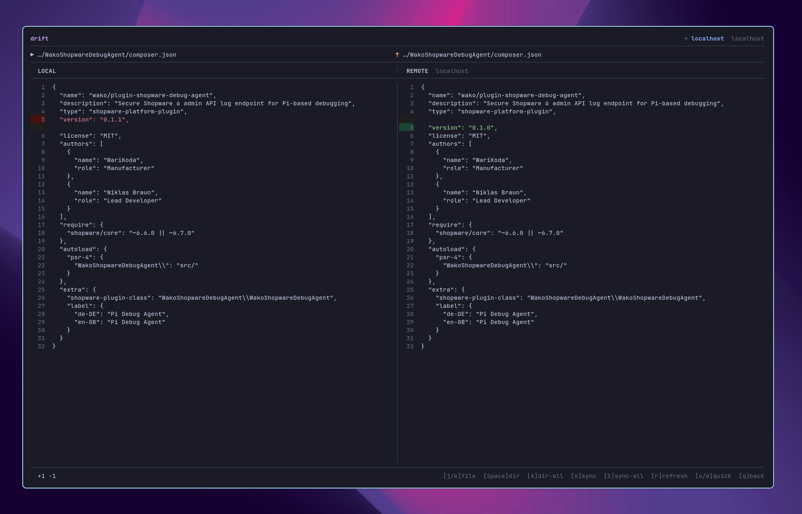

# drift

A terminal TUI for browsing, diffing, and syncing files with remote hosts — think PHPStorm's "Browse Remote Host" and "Sync with Deployed To", but in your terminal.

Supports **SFTP/SSH**, **FTP**, and **FTPS** targets. Runs on Linux and macOS.



> [!WARNING]
> **Alpha:** drift is in an early public stage. Expect rough edges, incomplete polish, and breaking changes between releases.

---

## Features

- Side-by-side local/remote file browser with multi-select (Space) and recursive directory marking
- Safe local/remote text preview in the opposite pane (`p`), with line numbers and wrapping
- Project-wide fuzzy file finder (`f`) for marking files
- Unified diff view with the file list on the left for local vs. remote files, unchanged
  stretches folded away behind `@@` hunk headers
- Per-file sync direction control: upload ↑, download ↓, delete local ✗, delete remote ✗, or skip —
- Bulk sync direction toggle (A key cycles all files at once)
- Auto pre-selection of sync direction based on file modification time
- Sync current file (s) or all marked files (S) in one keystroke
- Per-host path mappings (like PHPStorm's Deployment Mappings tab)
- Host manager: create, edit, delete, and test connections
- Nothing is written into your project: global hosts in `~/.config/drift/config.toml`, per-project hosts and mappings in `~/.config/drift/projects/<slug>.toml`
- Skips `.git`, `node_modules`, `.idea`, and other irrelevant directories automatically

---

## Installation

### From source (requires Go 1.25+)

```bash
git clone https://github.com/WariKoda/drift.git
cd drift
make install
```

This builds the binary and installs it to `~/.local/bin/drift`.

### Directly with Go

```bash
go install github.com/WariKoda/drift@latest
```

### Update after code changes

```bash
make update
```

---

## Usage

```bash
# Start in the current directory, last project, or dashboard (see below)
drift

# Open the project dashboard explicitly
drift dash

# Open a registered project by name or slug
drift open kunde-a

# Manage projects
drift projects list
drift projects add "KUNDE A" ~/work/kunde-a
drift projects edit kunde-a --name "KUNDE A GmbH" --path ~/work/kunde-a
drift projects archive kunde-a
drift projects remove kunde-a

# Show version
drift version
```

Navigate to any file or directory, press **Space** to mark it, then **s** to open the sync target picker.

### Project dashboard

drift can keep a registry of your projects (one per customer, say) and show them in a
dashboard on startup. From the dashboard you select a project and drift re-roots into it:
it loads that project's config and opens the file browser in its directory — the same as
`cd <path> && drift`, but without leaving drift.

The dashboard appears automatically when you run `drift` **outside** any registered
project and nothing has been opened yet, as long as at least one
project is registered. If you have opened a project before, `drift` restores that
one instead (its path must still exist). Inside a project directory, `drift`
opens the browser as before. `--dashboard` (or `drift dash`) always opens the
list; `--no-dashboard` stays in the current directory.

From the file browser, `P` opens a filterable switcher and leaves the current
session alone. Esc goes back. Enter on another project re-roots. `m` (with an
empty filter) opens the full dashboard to add, edit, archive, or remove entries.

`drift open` accepts a display name or slug: exact slug, then exact name
(case-insensitive), then a unique prefix or substring of either.

`~/.config/drift/projects.toml` holds a slug, display name, local path and timestamps per
project. Its hosts and mappings live next to it in `~/.config/drift/projects/<slug>.toml`.

The registry is also how drift knows which project a directory belongs to: the registered
project whose path is the directory or a parent of it, longest match first. Registering is
therefore what gives a directory hosts of its own.

drift offers to do it for you. Start it in a repository that no project covers and it asks,
suggesting the repository root rather than whatever subdirectory you were in — press `y` to
register, any other key to skip. Otherwise: `drift projects add .`, or `n` on the dashboard,
which prefills the repository root too.

### Typical workflow

1. Run `drift` in your project directory
2. Mark one or more files/directories with **Space**
3. Press **s** and choose a host
4. Review diffs and suggested sync directions
5. Sync the current file with **s** or all files with **S**

---

## Key Bindings

### Project Dashboard

| Key | Action |
|-----|--------|
| `j` / `k` or `↑` / `↓` | Navigate |
| `Enter` | Open project (re-root drift into it) |
| `1`–`9` | Jump to / open the n-th project |
| `n` | New project |
| `e` | Edit project |
| `d` | Remove project (with confirmation) |
| `a` | Archive / unarchive project |
| `.` | Show / hide archived projects |
| Click / wheel | Move the cursor; double click opens |
| `Esc` | Back to the browser when opened from `P` then `m`; otherwise quit |
| `q` | Quit drift |

### Project switcher (`P` in the file browser)

| Key | Action |
|-----|--------|
| type | Filter by name, slug, or path |
| `↑` / `↓` or `Ctrl+n` / `Ctrl+p` | Navigate |
| `Enter` | Open the selected project |
| `m` | Open the dashboard to manage projects (empty filter only) |
| `Esc` | Back to the browser (session kept) |

### File Browser

| Key | Action |
|-----|--------|
| `j` / `k` or `↑` / `↓` | Navigate in the active pane |
| `h` / `←`, `l` / `→` / `Enter` | Collapse / open directory |
| `g` / `G` | Jump to top / bottom |
| `Tab` | Switch local / remote pane |
| `p` | Toggle a text preview in the opposite pane |
| `c` | Copy the loaded preview content to the clipboard |
| `PgUp` / `PgDn`, `Home` / `End` | Scroll / jump within an active preview |
| `@` | Choose or change the remote host |
| `Space` | Mark / unmark file or directory in the active pane |
| `V` / `*` | Mark the current level / invert the active pane's selection |
| `f` | Fuzzy-find files across the project and mark them |
| `s` | Sync marked local and remote files |
| `r` / `/` / `?` | Refresh active pane / filter / help |
| `H` | Open host manager |
| `P` | Switch project (filterable picker; `m` opens the dashboard) |
| `Esc` | Clear filter and selections |
| `q` / `Ctrl+C` | Quit |

### Diff View

| Key | Action |
|-----|--------|
| `j` / `k` or `↑` / `↓` | Scroll diff content by line |
| `PgUp` / `PgDn` | Scroll diff content by page |
| `Ctrl+u` / `Ctrl+d` | Scroll diff content by half page |
| `Home` / `g`, `End` / `G` | Jump to start / end of diff content |
| `[` / `]` | Jump to the previous / next hunk |
| `Enter` / `l` | Expand or collapse the first fold in view |
| `h` | Collapse the fold around the top of the viewport |
| `c` | Expand or collapse every fold in the file |
| `Tab` / `Shift+Tab` | Select next / previous file |
| `Space` | Cycle sync direction for current file |
| `A` | Cycle sync direction for all files |
| `s` | Sync current file |
| `S` | Sync all files |
| `u` / `d` | Quick upload / download current file |
| `e` | Toggle the last bulk-sync error list (when errors occurred) |
| `r` | Refresh diffs |
| `q` / `Esc` | Back to browser |

### Host Manager

| Key | Action |
|-----|--------|
| `n` | New host |
| `e` / `Enter` | Edit host |
| `d` | Delete host |
| `t` | Test connection |
| `q` / `Esc` | Back |

### Mouse

The mouse works in the file browser, the diff view and the host manager.

| Action | Effect |
|--------|--------|
| Wheel | Scroll the pane under the pointer |
| Click | Move the cursor there, and focus that pane |
| Click on a pane label | Focus that pane |
| Click on a fold marker | Expand or collapse that fold (diff view) |
| Double click | Expand a directory (local), open one (remote), cycle a file's sync direction (diff view), edit a host (host manager) |
| `Shift`+Click | Select text with the terminal's own selection |

Mouse reporting takes the terminal's native text selection away, so it can be
turned off:

```bash
drift --no-mouse              # this run only
DRIFT_NO_MOUSE=1 drift        # via environment
```

```toml
# ~/.config/drift/config.toml — permanently
[ui]
mouse = false
```

The flag beats the environment variable, which beats the config file. Mouse
support is on unless one of them turns it off.

---

## Theming

Drift uses the terminal palette by default and auto-detects Omarchy themes from
`$XDG_STATE_HOME/omarchy/current/theme/colors.toml` (normally
`~/.local/state/omarchy/current/theme/colors.toml`). The legacy location under
`$XDG_CONFIG_HOME` is supported as a fallback. You can override this with:

```bash
DRIFT_THEME=auto|ansi|omarchy|default
DRIFT_THEME_FILE=/path/to/colors.toml
```

`auto` loads Omarchy colors first and falls back to ANSI terminal colors.
`default` uses Drift's built-in fallback palette.

---

## Logging

Logging is **off by default**. When enabled, drift writes diagnostics
(connection lifecycle and every connect/sync/diff error, with full paths) to a
file — never to the terminal, which the TUI owns. Enable it per run with a flag
or environment variable; the flag wins:

```bash
drift --debug                 # debug level → ~/.config/drift/drift.log
DRIFT_DEBUG=1 drift           # same, via environment
drift --log /tmp/drift.log    # info level → explicit path
DRIFT_LOG=/tmp/drift.log drift
```

`--debug` (or `DRIFT_DEBUG=1`) raises the level to debug, adding a line per
synced file; without it the log stays at info level. The log file is appended to,
not rotated. This complements the in-app `[e]` error list in the diff view, which
only holds the most recent bulk sync.

---

## Configuration

### Global config: `~/.config/drift/config.toml`

```toml
[defaults]
user = "deploy"

[[hosts]]
name       = "prod"
hostname   = "example.com"
port       = 22
user       = "deploy"
root_path  = "/var/www/html"
protocol   = "sftp"

  [hosts.auth]
  type     = "keyfile"
  key_file = "~/.ssh/id_ed25519"
```

### Project config: `~/.config/drift/projects/<slug>.toml`

drift writes this file; the slug comes from the registry. Nothing is stored in the
project directory itself.

```toml
[defaults]
user = "deploy"

[[hosts]]
name      = "staging"
hostname  = "shopdev.example.com"
port      = 21
user      = "webuser"
root_path = "/var/www"
protocol  = "ftp"

# For ftps with a self-signed / mismatched certificate (skips TLS verification):
# insecure_tls = true

  [hosts.auth]
  type     = "password"
  password = "$DEPLOY_PASSWORD"

  [[hosts.mappings]]
  local  = "plugins/plugin1"
  remote = "html/custom/plugins/plugin1"

[[mappings]]
local  = "src"
remote = "html"
```

The file holds credentials verbatim, so it is mode `600` in a `700` directory. Use
`$ENV_VAR` for a password or passphrase if you would rather keep the secret in your shell
environment or a password manager; drift expands it at connect time.

### Path Mappings

`local` paths are relative to the project root. `remote` paths are relative to the host's `root_path`.

When effective `mappings` are configured, only files that fall under a mapping rule can be synced. Files outside all mappings are excluded. Without mappings, all files sync relative to `root_path`.

### Auth types

| Type | Fields |
|------|--------|
| `keyfile` | `key_file`, `passphrase` (optional) |
| `password` | `password` (supports `$ENV_VAR`) |
| `agent` | none — uses SSH agent |

For a project host, all of these live in `~/.config/drift/access.toml` rather
than in the project. For a global host they stay in the global config.

### Nothing in your project

drift keeps no file in your working tree. No `.drift/` directory, no dotfile, nothing to
add to `.gitignore` and nothing to commit by accident:

| File | Holds |
| --- | --- |
| `~/.config/drift/config.toml` | global hosts, `[ui]` |
| `~/.config/drift/projects.toml` | the registry: slug, name, path, timestamps |
| `~/.config/drift/projects/<slug>.toml` | one project's hosts and mappings, mode `600` |

The trade-off is deliberate: mappings do not travel with a clone. Every developer enters
them once per machine, and when someone moves a directory in the repo there is no commit
that fixes the mapping for everyone.

#### Coming from 0.1.6-alpha or earlier

Those versions kept a `.drift/config.toml` in the project, with credentials either in it or
in `~/.config/drift/secrets.toml`. **0.1.7-alpha is the release that moves all of it into
the project store**, and it is the only one that can: this version no longer reads those
files at all.

So if you are upgrading from 0.1.6-alpha or earlier, install
[0.1.7-alpha](https://github.com/WariKoda/drift/releases/tag/v0.1.7-alpha) first and start
it once in each project — it migrates and reports what it moved — then upgrade to the
current version. Skipping it leaves your hosts in files nothing reads, and drift will look
like it has no hosts for those projects.

If such a config was ever committed, the password in it is in your repository's history,
where deleting the file later does not reach it. Rotate it.


---

## Project Structure

```
internal/
  config/       config types, loader, writer
  project/      project registry model + store (projects.toml)
  diff/         diff engine, result types, renderer
  ftp/          FTP/FTPS client (jlaffaye/ftp)
  fs/           local file walker, directory reader
  log/          optional file-based diagnostics
  pathmap/      local ↔ remote path resolution with mapping rules
  remote/       protocol-agnostic Client interface and connection factory
  sftp/         SFTP client
  ssh/          SSH auth and known_hosts verification
  styles/       shared palettes and lipgloss styles
  sync/         sync plan types and direction policy
  tui/
    app.go      root Bubble Tea model, screen routing
    browser/    file browser screen
    dashboard/  project dashboard screen
    projectform/ project create/edit form
    projectselector/ project switcher modal
    diffview/   diff + sync screen
    hostform/   host create/edit form (incl. mapping manager)
    hostmanager/ host list screen
    hostselector/sync target picker
    statusbar/  reusable one-line status renderer
    textfield/  shared single-line text input widget
    styles.go   TUI-facing style aliases
```

---

## Development

```bash
go test ./...
go vet ./...
go build ./...
```

### Local install

```bash
make install
```

### Versioned build

```bash
make release-build VERSION=vX.Y.Z
```

---

## Contributing

Issues and pull requests are welcome.

For development notes and contribution workflow, see [`CONTRIBUTING.md`](CONTRIBUTING.md).

---

## License

MIT — see [`LICENSE`](LICENSE).
