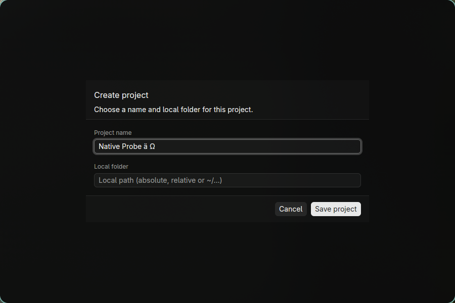
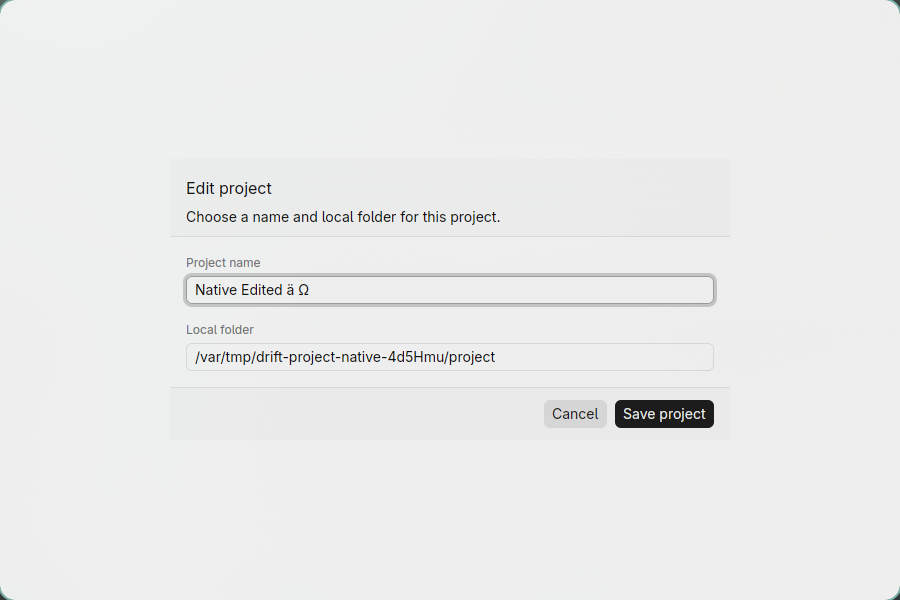
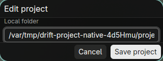

# Projektformular: begrenzte native Wayland-Prüfung

Stand: **7. Oktober 2026**. Dies ist eine Prüfung am echten GPUI-Fenster,
keine HTML-Vorschau oder Headless-Simulation. Sie deckt einen Teil der nativen
Abnahme ab, nicht die gesamte GUI oder alle Zielplattformen.

## Umgebung und geprüfter Stand

- Linux, Hyprland **0.56.2**, Wayland; der Compositor meldet `xwayland: false`.
- Ein Monitor, 3440×1440, Skalierung **1**; unveränderte Kit-Basisschrift.
- Wiederverwendetes Release-Binary `rust/target/release/drift-gui`, Version `0.1.0`.
  SHA-256: `4e8b3a0dae59f7097338a9cda135d4d2f26b2d0355ab519d4484509e02104de8`.
- Checkout `e4fc6c0`, Formularimplementierung `029d6d7`; dazwischen nur
  Dokumentationsänderungen, keine Änderungen an Rust-Crates oder Cargo.lock.
- Kit Dark und Light in getrennten Starts; kein laufender OS-/Themewechsel getestet.
- Tastaturereignisse über Waylands virtuelle Tastatur (`wtype`), echte native
  Controls und sichtbare Fokusringe. Unicode-Eingabe ist **kein IME-Nachweis**.
- `HOME` und `XDG_CONFIG_HOME` liegen unter
  `/var/tmp/drift-project-native-4d5Hmu/`; das Projekt ist ein leerer temporärer
  Ordner. Keine realen Drift-Daten, Server, Secrets oder Projektdateien verwendet.

Die erste Erkundung wurde wegen gleichzeitiger Desktopbedienung unterbrochen.
Die folgenden Befunde stammen aus der anschließend ausdrücklich vereinbarten
Testpause mit geprüftem Fensterbesitz und dynamisch ermittelten Aufnahmegrenzen.
Beide Testfenster wurden geschlossen und der ursprüngliche Fokus wiederhergestellt.
Es wurden keine Desktop-Konfigurationsdateien geändert.

## Beobachtete Ergebnisse

| Fall | Ergebnis / Grenze |
| --- | --- |
| Create bei 900×600, Dark | Dialog zentriert, feste Header-/Footer-Flächen, getrennte Feldlabels und sichtbare Aktionen. |
| Vorwärts-Tab | Name → Path → Cancel → Save project; jeweils sichtbarer nativer Fokusring. |
| Rückwärts-Tab | Save → Cancel und Path → Name geprüft; keine vollständige native Rückwärtsrunde behauptet. |
| Enter in Name und Path | Formular bleibt offen; noch keine Registry-Datei, kein implizites Speichern. |
| Cancel per nativem Enter | Rückkehr zur Liste; vor dem ersten Save weiterhin keine Registry-Datei. |
| Save mit leerem Pfad, Ctrl+S | Sichtbarer Fehler `path must not be empty`; Name und Formular bleiben erhalten, keine Registry-Datei. |
| Create mit gültigem Pfad, Ctrl+S | Genau ein Projekt erscheint in Liste und echter temporärer Registry; Unicode-Name `Native Probe ä Ω` exakt gespeichert. |
| Resize 900×600 → 320×180 → 900×600 | Draft und Feldfokus erhalten; Header/Footer bleiben sichtbar. Nach Fehleranzeige wird der knappe Body begrenzt; der anschließende Save funktioniert. |
| Edit bei 320×120, Dark | Fokussiertes Name- bzw. Path-Feld vollständig sichtbar, Footer-Aktionen erreichbar. Tab revealt das andere Feld; Header/Footer bleiben stehen. Das jeweils andere Feld/Label darf außerhalb des Body-Viewports liegen. |
| Edit-Cancel nach Draftänderung/Resize | Registry bytegleich zur zuvor gespeicherten Fassung. |
| Explizites Edit-Save | Nativer Save-Button per Tab/Enter schreibt `Native Edited ä Ω`; Projekt-Slug und Pfad erhalten. Temporärer Projektordner bleibt leer. |
| Native History | Ctrl+Z nimmt eine Eingabegruppe zurück; Linux-Ctrl+Y stellt den langen Unicode-Text wieder her. Ctrl+Shift+Z hatte hier keine Redo-Wirkung. Keine IME-/Clipboard-History getestet. |
| Edit bei 900×600 und 320×120, Light | Lesbare Felder/Aktionen, sichtbarer Path-/Cancel-Fokus; Escape kehrt ohne Registryänderung zurück. Kein gemessener WCAG-Kontrastnachweis. |
| Fensterschließen | Beide Prozesse nach gezieltem Close beendet; beide stderr-Dateien leer. Kein Crash oder sichtbarer Formularfehler im geprüften Ablauf. |

### Native Aufnahmen

Nur die isolierten Testfenster sind abgebildet; die Pfade gehören zum temporären Testprojekt.

Weitere lokale PNGs, Fenstergeometrien, Registry-Snapshot und Screenshot-Hashes
liegen unter `/var/tmp/drift-project-native-4d5Hmu/`. Das Hilfsskript `native.py`
ist eine sitzungsgebundene Prüfhilfe, kein portabler CI-Test.

## Automatisierte Nachweise getrennt halten

Die sechs Go-/Rust-Linux-/Rust-macOS-Checks von **PR #98**, Head `e4fc6c0`, sind
bestanden: [PR-Lauf](https://github.com/WariKoda/drift/actions/runs/37627684353) und
[Push-Lauf](https://github.com/WariKoda/drift/actions/runs/37627674302).
Das ersetzt keine native macOS-Abnahme.

Ein zusätzlicher lokaler `cargo build --locked --release -p drift-gui` startete
hier einen Abhängigkeitsneubau und wurde am äußeren 120-Sekunden-Limit beendet.
Er ist **kein bestandener Build**; der danach vorgesehene Lauf der
`projects::design_tests` wurde nicht erreicht. Der Hash des zuvor nativ geprüften
Release-Binaries blieb unverändert. Diese Session ändert nur Dokumentation und
Aufnahmen, keinen Produktionscode; die frühere Gesamtprüfung und frische PR-CI
werden nicht als hier erneut ausgeführte Tests ausgegeben.

## Noch offen

- X11, macOS Intel/Apple Silicon, HiDPI und andere Schrift-/Viewportkombinationen.
  Insbesondere sind volle Input-Bounds bei 104 nutzbarer Parent-Höhe und
  Kit-Schrift 24 nicht abgenommen.
- Echte IME-Komposition, UTF-16-/SDK-Folgecallbacks, Accessibility/Screenreader,
  OS-Clipboard und Berechtigungsdialoge. Virtuelle Unicode-Tasten prüfen diese nicht.
- Native Pointer-/Wheel-/Body-Scrollprüfung, vollständige Reverse-Tab-Runde,
  Fokus-Rückkehr aus Hilfe/anderen Modals und kontrollierte Busy-/Writing-Zustände.
- Laufender Theme-/OS-Wechsel, Maximieren/Restore, native Dekorationen und Fensterpersistenz.
- Desktopintegration: Hyprland meldete bei beiden Starts leere `class` und `title`.
  Fensteridentifikation erfolgte deshalb über die PID. App-ID/Titel sind separat
  zu klären; das Formularlayout behebt oder erklärt diesen Befund nicht.
- Host-/Trust-/Transferdialoge, laufende Remote-I/O und WAN-Performance waren nicht
  Teil dieser Prüfung. SSH-, Monokai-, Paketierungs- und Release-Gates bleiben bestehen.

**Fazit:** Kein neuer Formularblocker in diesem begrenzten Wayland-/Scale-1-Ablauf.
Kein pauschales Bestehen der nativen Plattformabnahme und keine Release-Freigabe.
